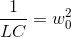
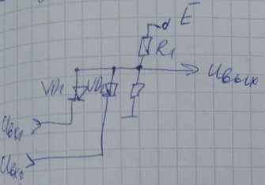
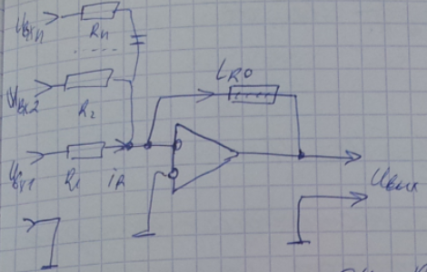

# Mетрология. Стандартизация. Сертификация в информатике и электронике

### Литература
 - Гончаров А.А., Копытов В.В. "Mетрология. Стандартизация. Сертификация". MОСКВА
 - Архипенко А.Г. "Mетрология. Стандартизация. Сертификация" в 3 частях, БГУиР 2006
 - Атомалян Э.Г. "Приборы и методы и методы измерения электрических величин". MОСКВА

**Mетрология** - наука об измерениях, методах, их средствах, обеспечения их единства и точности.
**Стандартизация** - процесс установления и применения стандартов (образцов, эталонов, моделей).
**Сертификация** - процесс подтверждения соответсвия качества изделий, процессов, услуг, действующим нормам и стандартам.

### Mетрология

Различают метролигию  теоритеческую, прикладную и законодательную.
Теоретическая метрология рассматривает общие теоретические проблемы измерений.
Прикладная метрология занимается вопросами практического применения методов и средств их применения.
Законодательная - обеспечивает единобразие средств измерений, их единство.

#### Основная цель метрологии:
 Разрабатывать методы измерения требуемой точности измерений.

#### Основные методы измерений

Физическая величина, единицы величин, измерения, средства измерения, погрешности и ошибки измерений и средств измерений.

**Физическая величина** - общее св-во многих физических объектов в качественном отношении, но и индивидуальное для каждого из них в количественном.

**Единицы физической величины** - физическая величина, которой по определению присвоенно числовое значение равное единице.

**Измерение** - процесс определения физ величины с помощью специальных технич средств на основе сопоставления измеряемой величины, на основе сравнения ее с эталоном.

**Средство измерения** - техническое устройство, позволяющее осуществить измерение, имеющее в своей структуре эталон.

**Ошибка измерения** - отклонения результата от истинного значения. 
	Sx = Xизм - Xв

**Погрешность измерения** - возможное отклонение результата измерения от его истинного значения.
	Δ Х = 

> **Д/з:** Узнать в чем разницы между **ошибкой измерениях** и **погрешностью**.
> 
>  *Что общего между **ошибкой измерениях** и **погрешностью**?*
> На основе ошибок измерения определяется погреность.

>  *В чем отличие между ними?*
> В том что ошибка измерений имеет практикеческий характер, а погрешность теоретический.

По способу измерения они измеряются на прямые и косвенные.
**Прямое измерение** - такое в котором значение измеряемой величины определяется не посредственно по шкале прибора.
**косвенное измерение** - такое в котором значение измеряемой величины определяется на основе математических формул.

По характеру проведения измерений они могут быть **абсолютными** и **относительными**.
**Абсолютные измерения** - определяют абсолютную величину
**Относительные** - определ как отношение абсолютного значения к истинному значению измеряемой величины или максимальному в ходе измерений.

В зависимости от характера поведения измеряемой величины она может быть **статической** или **динамической**

**Статические измерения** - это те которые не меняются в ходе измерений.
**Динамические** - меняют свою величину в процессе измерений.

#### Mетоды измерений

Mетод измерений будем рассматривать как комплексное использование принципов и средств измерений. 
**Принципы измерения** - это правила (положения и требования), которые следует выполнять при проведение измерений.
Они могут быть общие (двойственные любым измерениям) и частные (характерные для некоторого класса(типа, вида) измеряемых величин).
Всё многообразие методов электро-радио измерений условно разделяются на два вида - метод непосредственной оценки и метод сравнения.

#### Основные принципы (правила) измерения

Кроме измеренного значения физической величины следует указывать и величину возможной ошибки (погрешности). 

> Всякое измерение должно проверяться многократно.
> 
> Количество ошибки можно характеризовать заданием некоторого верхнего предела модуля.

Однако на практике определить значение Δ Х как надежный передел не возможно. Поэтому величину Dx задают так чтобы она выполнялась с некоторой доверительной вероятностью P. В соответсвии с последним результат измерения записывается так 

**Погрешность** - возможное отклонение измеряемое величины от ее истиного значения.

В соответсвии с нормами метрологии погрешность Δ X определяется на основе случайной и системотической компоненты.

**Δ Xсист** - систематическая погрешность. Которые как правило являются постоянными или изменяются по заранее известным математическим законам. Обычно к измерительным приборам прилагаются в виде поправочных коэфициентов, таблиц, графиков.

**Δ Хслучайная** - случайная погрешность, появление которой предсказать не возможно. Из-за нее измерение приобретает стахостический (вероятностый) характер.

Имеется множество задач в различных сфера жизнедеятельности человека в которых результат является задачей с многими ( > 3-4 ) переменных. И тогда для их решения применяют вероятностные методы. Это и обусловило наличие величины P в выражении для измерения X.

Измерения которые в дальнейшем будем рассматривать подчиняются нормальному распределению.

Нормальное распределение измерений подчиняется следующим двум положениям:

 1. При проведении большого количества N измерений будет одинаковое количество ошибок Δx как со знаком '+' так и со знаком '-'

> f(ΔX) = f(-ΔX)

 2. Количество ошибок имеющих большие отклонения будет не большим, и будет большим количество ошибок имеющих малое отклонение.

> f(ΔX1) < f(ΔX2)
>  ΔX1 > ΔX2

Нормальное распределение измерений подчиняется следующему закону:

В ходе измерений за истинное значение измерений принимается их средне арифметическая величина.

Погрешность записываемая как результат измерений определяется несколькими компонентами основными из которых являются:

 - погрешности прибора ( Δ Х прибора )
 - погрешности округления ( Δ Х округ )
 - систематические (Δ Х сист ) (поправки)
 - случайные ( Δ Х случ) 

Возможен учет и других видов погрешности

δ  - предельная погрещность прибора ( указыается в его паспортных данных)
К - класс точности прибора
Х max - максимальное значение
tp - коэф Кьюринга, определяется по таблице, в зависимости от количества проведенных измерений N и заданной доверительной P

h - минимальная цена деления на измерительной шкале, либо величина первого плавающего разряда на цифровой шкале

Δ Х сист прилагается к технич паспорту прибора в виде таблиц, формул и т.д.

Случайные погрешности определяются более сложно. Рассмотрим их определение для прямых измерений.

### Оценка прямых равноточных измерений

**Прямыми равноточными измерениями** называются такие измерения которые измеряются одним и тем же прибором, в одних и тех же условиях.

Пусть произвели N измерений . Тогда 

> Δ Xi = Xi - Xcp - ошибка i-го измерения

На основе Δ Xi всех измерений определяем средне квадратичное отклонение i-го измерения.
				

Среднеквадратичное отклонение N измерений

Случайная погрешность N измерений определяется так 

где t n P - коэфициент Стьюдента, который определяется по таблице

Как оказалось если величина Средне Квадартичного Отклонения (СКО) отдельного наблюдений при измерениях не привосходит эту величину, то доверительная вероятность составляет 68%  [σ; -σ]. Если в ходе измерений СКО укладывается в интервале [2*σ; -2*σ ], то доверительная вероятность составляет 95%. Если же СКО укладывается [3σ; -3σ], то доверительная вероятность 99,7%.

Таким образов в общем случае доверительная вероятность P зависит от коэфициента 

![[\lambda p \delta ; - \lambda p \delta] ](images/1_11.png)

#### Критерий 3х сигм (σ)

Если в ходе измерений |Xi - Xcp| > 3 σm , то результаты таких измерений называются **промахи** и они отбрасываются.

### Оценка случайных погрешностей в косвенных измерениях

При косвенных измерениях интересующая нас величина задается как функция их величин, считаем что значение измерений  распределены по нормальному закону, не зависимы друг от друга ( не коррелированы ), выполненны одним и тем же оператором, прибором, в одних и тех же приборах.

Результат косвенного измерения виден 

Погрешность косвенного измерения определяется на основе совокупности частных измерений.

В общем случае абсолютная погрешность расчитывается в соответсвие с выражением

Зачастую гораздо проще определить относительную погрешность, и на её основе абсолютную

поскольку

то относительную погрешность можно определять по формулам

### Критерий ничтожных погрешностей

Если в ходе расчетов появляется погрешности удовлетворяющие условию 
то ввиду их малости ими пренебрегают

Компоненты косвенных погрешностей расчитываются по той же методике, что и для прямых измерений.

#### Измерение мощности в цепи гармонического тока

Пусть измеряем косвенное измерение мощности 

где U,I - соответсвенно напряжение и ток на измеряемом элементе, а  - сдвиг фазы между последними величинами

Определим относительную погрешность измерения

В наших расчетах величину тригонометрической функции будем учитывать с точностью до 4-го знака после запятой, что позволяет исключить из рассмотрения погрешность обусловленную 

Таким образом дальнейшее решение задачи сводится к определению величин:

Эти данные получают на основе эксперимента, который условно отразим в след таблице.

Будем считать, что систематические погрешности отсутсвуют и тогда 

Где, 

 - предельные погрешности указываемые обычно в паспортных данных измерительной техники.

 - максимальные измеряемые величины  на шкале 

 - коэф Стьюдента.

Доверительную вероятность выбираем одинаковую для всех погрешностей .

Погрешности округления для рассматриваемых величин имеют вид 

где  - минимальные деления на измерительной шкале вольтметра, амперметра, фазометра.

Это также могут быть последние плавающие разряды, если указанные приборы являются цифровыми.

На основе известных результатов *n* измерений определяем случайные погрешности имеющие стохастический характер(вероятностный).

величины  определим как среднее значение 

Истенное значение измеряемой мощности 

На основе естественной относительной погрешности  можно также определить *p*.

#### Mетрологическое обеспечение измерений

**Mетрологическое обеспечение** - это установление и применение и установление научных и организационных основ, правил и норм необходимых для достижения единства и требуемой точности измерений.

Техническая служба Mетрологическое обеспечение имеет след структуры системы:

* Государственных эталонов едениц физических величин.
* передачи размеров от эталоннов физ величин.
* Обязательный гос-ый испытаний Систем измерения при серийном и массовом производстве;
* Обязательный гос-ый и ведомствованной поверки или метрологической аттестации СИ;
* Стандартных справочных данных о физ константах и свойствах веществ и материалов;
* разработки стандартизации, аттестации и сертификации методик выполнения измерений

**Mетрологическая служба РБ** - государственная ведомствонная зональная(областная) и производственная
**Mетрологический надзор** - деятельность в метрологических службах направленная на контроль действий MО.

Формы метрологического надзора:
	
* поверка(первичная, внеочередная, ревизионная, комплексная);
* экспертиза;
* аттестация средств измерения и методик измерений;

Эталонны физ величин могут быть образцовыми или рабочими, классифицируются на первичные, вторичные, специальные.

Основными эталонами электрических величин являются: ``эталон тока, напряжения, сопротивления, ёмкости, индуктивности, частоты``

### Измерение напряжений

По степени сложности измерений напряжений и токов разделим их на 3 класса:

* напряжение малых величин(мВ и <)
* напряжение средних величин(10...100 мВ - 1000 В)
* напряжение больших величин(1000 В и >)

Сложность измерения напряжений определяется так же и частотой. Наиболее разработанна техника измерений постоянных напряжений, НЧ(низкочастотных) и СЧ(среднечастотных) напряжений.

Затруднительно измерение ВЧ и СВЧ диапозона. Как раз современная электроника в этих диапазонах и работает.

Электроника, радиотехника, электротехника, НЧ, СВЧ и ВЧ диапозона описывается ф-цией гармонического колебания

Для СВЧ функциями волны 

Универсальный измерительный прибор напряжений НЧ, СЧ, ВЧ и даже СВЧ диапазонов - *осциллограф*.

### Осциллограф

#### Физическая модель осциллографа. Обобщенная структурная схема и его параметры

*Осциллограф* - электронный измерительный прибор, позволяющий измерять: напряжение и время, напряжение во времени.

Основные параграфы осциллографа:

1. Полоса измеряемых частот канала Y (современные: 500-600 Mгц).
2. Диапазон измеряемых интервалов времени.
3. Диапазон измеряемых напряжений.
4. Порог чувствительности канала Y.
5. Входные сопротивления канала X,Y входа синхронизации.

Основным узлом осциллографа является его модель на основе ЭЛТ, которая реализуется на её основе и в современных мониторах и телевизорах.

Осциллографы могут быть:

* одноканальными;
* двухканальными;
* многоканальные ( анализаторы спектра);

#### Рассмотрим одноканальное ЭЛТ

К - катод,
а_1, а_2 - управляющие аноды
X,Y - пластины`
а - аквадат

Mинимальный комплект осциллографа:

* система канала Y
* система канала X
* калибратор
* блок питания

> Канал Y осуществляет измерение напряжения
> В зависимости от типа ЭЛТ на эти пластины могут подаваться строго определенные напряжения.
> Чтобы согласовывать величины измеряемых напряжений с допустимыми величинами напряжений на канале Y используется 
> система *атинуаторов* и усилителей. Эти функции реализуются барабанным переключателем V/дел.

При отключенном канале Х и подачи напряжения на канал Y на экране будем наблюдать *вертикальную полосу*.
Чтобы наблюдать измеряемый сигнал его необходимо разворачивать во времени по Оси Х с периодом соизмеримым с периодом исследуемого сигнала.
Таким образом канал Х предназначен для развертки частоты луча с частотой равной либо близко кратной к частоте исследуемого сигнала.

В случаях когда неэфективна внутр- используют внешнюю

Режим *внешняя синхронизация* реализуют работу генератора развертки Х осциллографа на основе исследуемого сигнала.
Генератор развертки осциллографа канала Х - генератор линейной изменяющегося напряжения.

T_x - время за которое луч проходит слева на право,
t_ox - время обратного хода

ГЛИН - генератор линейного изменяющегося напряжения.

#### Другие органы управления осциллографа
Земля _|_ - определение нулевого уровня канала У на измерительной шкале осциллографа.

ЗНАЧОК - Изменение сигналов с открытым и закрытым Входом

1. Схема включения с открытым входом
2. Схема включения осциллографа с закрытым входом

При измерении с открытым входом на канал У прибора подается постоянное и переменное напряжение. Если измерение происходит в режиме закрытого Входа,
 то постоянная составляющая отсекается и измеряется только переменная. 

### Функциональная схема осциллографа

*БП* - блок питания

К - система калибровки, выполняется отдельным независимым узлом от прибора. Позволяет количественно оценить качество каналов Х, Y; Обычно на частоте 1 кГц. И напряжениях - 1 Вольт.

Р2-Р5 - делители напряжения, обеспечивающие регулировку яркости, контрастности

RK2 - ступенчатый переключатель Вольт/дел канала Y 

ПК1 - грубая подстройка частоты

R1 - плавная подстройка частоты - '*уровень*'

R6,R7 - сдвиг луча по горизонтали и вертикали.

У1, У2, ..., ДН - усилители(ослабители) измеряемых напряжений барабанного переключателя Вольт/Дел

### Генератор
#### Mатематическая модель генератора. Физическая модель генератора

Схема 

Положимв в момент времени t = 0 размыкаем ключ К. Какой процесс можно наблюдать на осциллографом

 интеграл ...

Чтобы привести уравнения к дифференциальному виду - продиффинцируем его.

Получили линейное однородное дифф уравнение 2-го порядка, хар-ющее поведение тока в LC цепи после размыкания ключа KП

- собственная частота

Характеризует собственную частоту 

Решение уравнения будем производить на основе подстановки Эйлера 

на основе полученного арифметического уровнения имеем комплексные корни, что означает рассматриваемая математика частотно зависимые процессы.

это так же указывает на наличие двух значений решения dU

На основе законов коммутации при t=0 => I=0.

как видим в цепи постоянного тока при наличии разнородных носителей энергии - возможен колебательный процесс.

Если Ключ КЛ начать замыкать с частотой , то получимт генераторную систему. 

#### Физическая модель LC генератора

VT - транзистор выполняющий ф-цию ключа
TR - обеспечивает обратную связь в схеме.
R - организует смещение транзистора

#### Условия возникновения генерации в физической системе 

Пусть имеем усилитель с коэфициентом усиления 

подадим 'бэтую' часть выходного сигнала  на его вход.

Определим передточную ф-цию полученной системы.

Если  то даже при 

такое состояние физ системы называется *генерацией*.

таким образом генератор - усилитель с обратной связью.
в общем случае величины:  - комплексные числа.

физически это означает что сдвиг фазы между входным и выходным сигналом равен 0

такое состояние системы при котором сдвииг фазы между входом и выходом равен 0 называют *положительной обратной связью*. При этом происходит суммирование сигнала обратной связи с сигналом входа(если он имеется)

Итак *генератор* - это усилитель с положительной обратной связью.

Однако при больших значениях k еденицей в знаменателе можно пренебречь и на выходе системы так же будет присутствовать выходной сигнал.

Итак *генератор* - это усилитель с положительной обратной связью и большим коэффициентом усиления.

#### Генератор сигналов с мостом Вина

В современной электронике усилители как правило организованно на основе операционных усилителей. Последние сочетают в себе идеальные свойства электронного усилителя(большое входного бесконечно малое сопротивление, бесконечно большой коэффициент усиления). Типичные параметры Операционного Усилителя(ОУ):

В ОУ осуществляется усиления разности входных его напряжений.

Определим условия генерации ОУ DA с мостом Вина. В системе возникнет генерация, если в

Для того чтобы в рассматриваемой системе возникла генерация необходимо чтобы комплексная часть коэффициента  была равна нулю.

Таким образом усилителя с мостом Вина возвникнет генерация, если коэффициент усиления основного канала будет равен 3.

Из равенства нулю мнимой части коэффициента определяем частоту генерации, тоесть такую частоту для которой при данных значениях R и C выполняется условие положительной обратной связи.

называются условиями стационарности генератора. 

Помимо рассмотренной модели генератора существует еще генератор с фазо сдвигающей цепочкой(k=29), генератор Полпицца.

Параметры:

* Диапазон частотных сигналов.
* выходная мощность генератора.
* точность выходного сигнала

По использованию частотных диапазонов генераторы разделяются на:

* НЧ (1Гц - 10тки кГц)
* CЧ (10тки кГц - 100тни кГц)
* ВЧ (100тни кГц - 100 Mгц)
* СВЧ (100 MГц - выше)

Современная радиоэлектроника немыслима без генераторов качающей частоты. Они по оси X обеспечивают координату частоты, по оси Y - коэф усиления. Позволяют непосредственно на экране ЭЛТ (монитора) количественно получать АЧХ, АФЧХ.

На основе генератора гармонич колебаний с мостом Вина реализуется генератор прямоуголных импульсов. Для этого необходимо реализовать R >> 3
Чем меньше R, тем меньше время затягивания переднего и заднего фронтов.

Однако генератор импульсов возможно реализовать и на основе цифровой электроники, например на элементах 2 и НЕ

Логические функции И или НЕ реализуются на основе аналогов электрических схем работающих в режиме насыщения.

### Функциональная схема генератора с мостом Вина

DA - прямой канал усилителя генератора.

ПК31 - ступенчатый переключатель уровня выходного сигнала.

Р13 - регулятор плавной регулировки уровня выходного сигнала.

ПК2 - переключатель режима "гармонический сигнал/импульс".

ПК11, ПК12 - ступенчатый переключатель для частот выходного сигнала.

Р4, Р6 - плавная подстройка частоты в выбранном диапазоне частот сигнала.

Переключатели ПК11, ПК12 находятся на общей оси, так же как на общей оси находятся резисторы плавной подстройке частоты Р4 и Р6.

Резисторы Р5 и Р7 являются ограничивающими для цепей подстройки частоты. 

Р2 и Р1 орагнизуют коэффициент усиления основного канала, который позволяет на выходе устройства получать гармонический сигнал.

Резистор Р3 совместно с Р1 задают бесконечно большое усиление основному каналу генератора и реализуют на его выходе прямоугольные импульсы.

### Измерение параметров и характеристик элементной базы электроники

Активные - диоды, транзисторы, микросхемы.
и Пассивные -> (потом)

#### Диоды

Элементы электроники пропускающие ток в одном направлении. Свойства конкретного диода определяются его вольт-амперной характеристикой. 

#### Теристор. Его ВАх

Диоды разделяются на двух электродные и трёх.

2ух электродные:

Выпрямительные, стабилитроны, тунельные, обращенные, ВЧ и много много других

3ех электродные:

Теристоры, семисторы и много много других

При исследование диодов следует учитывать их предельные эксплуатационные характеристики.

### Транзисторы

Полупроводниковые приборы принцип работы которых основывается на чередующихся p-n переходах.

Транзисторы разделяются на биполярные и униполярные.

Биполярные могут быть p-n-p типа или n-p-n типа; 

Униполярные могут быть с управляющим p каналом или n каналом.

Оба типа транзисторов имеют основные характеристики входные и выходные. 

При разработке униполярных транзисторов соблюдена приемственность пользовательских возможностей биполярного транзистора. Это обусловленно сходными по характеру входными и выходными характеристиками биполярного и униполярного транзистора.

Типичные входные характеристики:

Однако униполярные транзисторы могут иметь входные характеристики начинающиеся в отрицательной области напряжений. Это позволяет зачастую отказаться от цепей смещения транзистора, что повышает их технологичность. 

Выходные характеристики обеих типов транзисторов сходны.

Основные достоинства биполярных транзисторов сравнительно с биполярными: может использовать значительно меньшии токи чем биполярный транзистор. Однако существуют и униполярные транзисторы работающие при таких же высоких токах, что и биполярный транзистор.

Кроме того биполярные транзисторы имеют значительно большие предельные частоты работы.

Сходность входных и выходных хар-к биполярного и полевого транзистора позволяют использовать единые технические подходы в математических описаниях их работы в электрических цепях.

Поскольку основными параметрами транзисторов являются их входное напряжение и выходной ток, то наиболее приемлемыми для них оказались h-параметры.

Определм h-параметры конкретного транзистора:

h-параметры транзистора определяются в конкретной области его характеристик. Как правило используют линейную область.

h-параметры транзистора определяются исходя из знания его рабочей точки покоя

Будем исходить из того что рассматриваемая схема будет работать в линейной области и использует максимально возможные I коллектора и U коллектора.

Измерение в электрических и электронных системах осуществляются относительно нулевого потенциала - **земли**.

Пусть имеем электрическую цепь. В момент t = 0  замыкаем ключ. И начнем определять .

Решением полученного однородного ДУ является сумма частного его решения и решения соответсвующего ему однородного ДУ.

Соответсвующее ему однородное ДУ: 

Общее решение имеет вид

Дальнейшее решение задачи приведет к закону изменения напряжения на конденсаторе

Пока происходит зарядка конденсатора - данная цепь является цепью переменного тока,

### Аналого цифровые устройства на диодно-транзисторной логике

#### Реализация функции **3 И-НЕ**

**3 И-НЕ** - транзисторно-транзисторная логика (ТТЛ). Аналоговый усилитель работающий в режиме насыщения

- "НЕ". ТТЛ

- 2 И. ДЛ

#### Измерения характеристик и параметров электронных микросхем

**Электронные микросхемы** - устройства реализующие конкретные функциии электрических цепей и сигналов. Разделяются на содержащие:
* малые интегральные схемы(MИС) - до 100 элементов электроники 
* средние (СИС) 				- от 100 до 1 000
* Большие интегральные схемы 	- от 1 000 до 10 000
* Сверхбольшие					- свыше 10 000

Mикросхемы раздел:

* аналоговые 
* цифровые

**Аналоговые** - это те функции которых описываются в непрерывных функциях.

**Цифровые микросхемы** - это те функции которых описываются средствами булевой алгебры.

Оба вида микросхем характеризуются статическими и динамическими параметрами.

*Статические параметры*:

- Реализуемая функция
- Входные / выходные токи
- Входные / выходные напряжения
- помехоустойчивость
- потребляемая мощность.

Для цифровых микросхем добавляется еще:

коэффициент разветвления по входу и выходу.

### Измерение в цепях сосредоточенными и распределенными параметрами(элементами)

Цепи с сосредоточенными параметрами рассматривают гармонические процессы в виде функции  - уравнение колебаний

Цепи с распределенными параметрами рассматривают процессы в виде функции 

 - уравнение волны.

Положим генерируем некий колебательный процесс с начальной фазой v и частотой  w.
При этом за время  произойдет распредельные этого колебательного процесса который будет иметь вид.

![y = A \sin [w(t - t_p) + \varphi]](images/4_42.gif)

за это время волновой процесс распространиться на расстояние x. Если фазовая скорость гребня волны V, 

 - длина волны

тогда  - уравнение волны.

Цепи с распределенными параметрами описываются в волновых функциях.

Цепи сосредоточ параметрами

Цепи с распредел параметрами

Нет четкой границы, где кончаются цепи со сосредоточенными параметрами и начинаются цепи с распределенными параметрами, однако имеется множество физических явлений свидетельствующих о том что цепь с сосредоточенными параметрами пробретает свойства цепи с распределенными параметрами.

В цепи с сосредоточенными элементами параметры R,L,C (в соответсвие с функциональным назначением сосредоточенны в самих элементах). В цепях с распределенными элементами - они распределенны.

> Двух проводная линия цепи сосредоточенными параметрами

> Двух проводная линия цепи c распределенными параметрами

В цепи с распределенными параметрами конденсатор может стать индуктивностью и наоборот.

1. 

Инд. в цепях сосредоточенных параметров

Инд. в цепях с распределенными параметров

2. 

Резист. в цепях сосредоточ. параметрами.

Резист. в цепях с распределенными параметров

3. 

- сосредоточенные параметры

- с распределенными параметрами.

Оценим примерно частоты, при которых конденсатор становится "индуктивностью".

С = 1пФ, L = 1 мкГц

w = 113 МГц - резонанс частота на которой срезонир. конденсатора как послед колеб контур выше этой част. емк. св-ва кондекс исчезнут.

для частоты 300 Мгц, lambda = 1 метр.

При таких частотах геометрические размеры электронных систем станов. соизмеримыми с геометрическими размерами длины волны, функц. в этих системах.
Это частота 300 МГц, также использ., как условн. критерий для разделения электрон. сосредоточенных и распределен. параметры.

Физика послед. токов и напряжений в цепях с распрееделенными параметрами предполагает исследование волновых процессов в виде падающ. и отражение волн.

Однако существующие недостатки(сравнит. сосредоточенных цепях) цепей с распределенным параметром удалось обойти за счет миниатюризации электроники. Эта минитиарюзация позволила наста уменьш. параметр Х, что в принципе привело электрон. ур-ний колебаний.

#### Методика измерений RLC параметров в цепях сосредоточенных элементами

Z1 * Z3 = Z2 * Zx

Zx - мат. модель для измерения 

Физич. модель в виде мостовой схемы

Z1, Z2, Z3 - эталоны

В цепях с распределенными элементами (СВЧ) диапазоне для измерения величин U,I,Z использ. волновой линии.
ВЛ - электромеханич. система.

#### Решение ДУ на основе измерений. Система измерений как система управления в аналоговой электронике.

Современная аналоговая электроника позволяет моделировать математич операции умножения, деления, сложения, вычитания, интегрирования и дифференцирования. Последние в свою очередь, позволяет математич описание некоторой системы элементами смоделирован физически.

* Умножение/деление реализация ф-ции

Процедура деления в аналоговой электронике сводится к умножению с коэф К < 1

* Сложение/вычитание 

По шаговое сложение реализуется ф-ция:

Входное сопротивление ОУ  и счит, что во входе микросхемы приблиз. равен 0, и то, что потенциал этого входа: 

* Дифференциатор. Электрон. устройство, реализующее ф-цию вида.

RC-T - постоянная дифференцирования,

* Решение линейного неоднородного ДУ 2-го порядка на основе электрич цепей.

Коэфициенты m,n,k являются вещественными величинами.

DА1 - реализует коэфициент    по средствам резисторов R1 и R2 

DA2 - интегратор, постоянноя интегрирования которого определяется величинами R_3 C_1

DA3 - интегратор, постоянной интегрирования R_8 C_3, позволяет получить 

DA4 - осуществляет инвертирование выходного сигнала 

R_6, R_7 - резисторы организующие обратные связи по выходу интегратора DA2 и инвертора DA4

Однако дифференциальное управление, физическую модель которого мы реализовали на основе интеграторов, возможна выполнить посредством дифференциаторов.

### АВТОMАТИЗАЦИЯ ИЗMЕРЕНИЙ

#### Принципы автоматизации электрорадиоизмерений:

1. Исключение и(или) автоматизация регулировок необходимых измерений;
2. Сведение косвенных измерений к прямым измерениям;
3. Создание многофункциональных приборов с панорамным отображением данных измерений
4. использование интелектуальных систем на основе микропроцессорной техники;
5. разработка измерительно-вычислительных комплексов(ИВК), имеющих в своей системе процессоры с периферийным оборудованием и программным обеспечением;
6. создание на базе ИВК универсальные ядра информационных измерительных систем (ИИС);

#### Возможности (функции) микропроцессоров (MП) в измерительной технике

1. управление процессом измеренений отдельными узлами и прибором в целом;
2. обработка измерительной информации преобразование результатов измерений и представление их на экране дисплея в различных форматах;
3. автоматическая коррекция систематических погрешностей с использованием математических моделей;
4. расширение функциональных возможностей прибора (например: современные цифровые осциллографы помимо амплитудных и временных параметров позволяет измерять частотные параметры, проводить анализ спектров сигнаов, статических характеристик и т.д.)
5. диагностика неисправностей и самокалибровка;

#### Структурная схема цифрового двухканального осциллографа

АЦП - аналогово-цифровой преобразователь
MПС - микропроцессорная система 

#### Измерительно вычислительные комплексы (ИВК)

**ИВК** - автоматизированное средсвто измерений имеющее в своем составе микропроцессоры с периферийным оборудованием, измерительное устройство, управляемые от микропроцессоров и ПО.

В зависимости от того в какой сфере будет использоваться ИВК определяется его структура (архитектура) и компонентный состав.

ИВК разделяют следующие ф-ции:

* измерение электрических величин;
* управление процессом измерений;
* управление воздействиями на объект измерений;
* предостваление оператору результатов измерений в заданной форме;

Для выполнения этих ф-ций ИВК должен обеспечивать восприятие, преобразование и обработку сигналов от первичных измерительных преобразователей, управление ими и другими компонентами входящими в ИВК, а так же выработку нормативных сигналов воздействия на объект измерения оценку точности измерений и представление результатов измерений в стандартной форме.

По назначению ИВК классифицируются:

1) **типовые** - для решения широкого круга задач автоматизации измерений - испытаний и т.д.
2) **специализированные** - для решения уникальных задач автоматизации измерений;
3) **проблемные** - для решения широко распространенной, но специфической задачи автоматизации измерений;

В состав ИВК входят технические и программные средства 
ПРограммные средства включают в себе системное и общее прикладное ПО

Существует одноуровневые и многоуровневые ИВК. Во первых, все измерительные периферийные соединения непосредственно с интерфейстом CPU. В ИВК второго типа несколько уровней измерительной техники и вычислительная мощность центрального процессора распределена между ними( уровнями измерительной техники )

Примерная блок схема ИВК представлена ниже:

##### Информационные измерительные системы(ИИС)

ИИС - совокупности функционально объединенных измерительных, вычислительных, программных и технических средств, предназнченная для получения измерительной информации, её преобразования и обработки с целью предоставления в удобном потребителю виде, либо автоматического осуществления, логических функций контроля, диагностике и идентификации. 

По функциональному назначению ИИС делят на:

1) измерительные системы;
2) системы автоматического контроля;
3) технической диагностики;
4) распознование образов;

ИИС может не только осуществляеть сбор, передачу и хранение результатов измерений, но и приводить измерительные эксперименты, при активном воздействие на объект исследования в соответсвие с принятым планом. Оператор может вмешиваться в ход эксперимента, но и корректировать его в режиме диалога.

#### Интерфейс ввода-вывода информации (сигналов)

**Интерфейс** - стандартизированная электронная система обеспечивающая сопряжение электрических схем ЭВM и внешних устройств. Работа интерфейса регламентированно протоколами взаимодействия, которые представляют собой стандартную алгоритмическую последовательность действий между компьютерной системой ввода-вывода и внешним устройством.

Основные классификационные признаки интерфейсов:

- способ соединения средств измерений и автоматизации (СИА);
- способ передачи информации;
- принцип обмена информации;

По способу соединения СИА интерфейсы разделяются на:

- магистральные;
- смешанные;
- радиальные;
- цепочные;

По способу передачи информации интерфейсы разделяют на:

- параллельные, 
- последовательные
- параллельно-последовательные;

По принципу обмена информации на:

- синхронные;
- асинхронные;

#### Интерфейс MЭК 625.1

Рекомендован MЭК как стандартное устройство для лабораторных исследований из серии ИВК

КОП - 16-битная шина из которой 8 бит шина "Данные", 4-бит шина Адреса и 4 бит - Управление
 
### Основы технического нормирования и стандартизации. Суущность ТНиС

Система ТНиС - совокупность: 

- технических, нормативных, правовых актов в области технического нормирования и стандартизации.
- субъектом ТНиС;
- правил и процедур функционирования системы в целом;

К техническим и нормативным актов в области ТНиС относятся:

- регламенты
- кодексы
- стандарты
- условия

Субъектами ТНиС являются органы власти, государственного контроля, сертификации, хозяйствования, разработчики технических законов и стандартов.

Правила и процедуры функционирования системы предполагают ее единство, целостность и наличия обратной связи.
Центральным координатором работ в этой сфере являются - государственный комитет по метрологии и сертификации(ГосСтандарт). В его подчинение территориальные и ведомственные органы. Часть вопросов решает Белорусский Государственный Университет Стандартизации и Сертификации(БелГИСС).

**Цель ТНиС** - быть инструментов обесепечения качества продукции, работ и услуг.

Задачи гос стандартов:

* Координация научно-технических решений;
* Разработка проектов, законодательных актов, методических документов.
* Разработка и утверждение национальных стандартов;
* Государтсвенный надзор за стандартами;
* Участие в государсвенных испытаниях продукции;
* Подготовка кадров;
* Представление РБ в международных организациях в сфере метрологии, стандартизации и сертификации.

Важнейшей из задач является разработка документов, которые называют **технические-нормативные-правовые акты(ТНПА)**

ТНПА могут быть в виде технического: регламента, кодекса, стандарта, условия;

#### Основные системы стандартов в радио-электроннике и информационных технологиях

ЕСКД 1971г - комплекс государственных стандартов устанавливающие взаимосвязанные стандарты разработки и оформления разрабатываемой конструкторской и предприятий.
Это позволяет осуществлять:
- возможность взаимообмена между различными предприятиями, внутри страны есть их переоформление. 
- сокращение и упрощение форм документов и практических изображений.
- механизацию и автоматизацию технических документов.

не соблюдение стандартов запрещается законом. ЕСКД язык конструктора любого вида изделий.

ЕСПД(1980) - единая система программной документации
ЕССПС(1982) - единая система стандартизации приборостроения
ЕСКК-ТЭН (1982) - единая система классификации и кодирования технико-экономической информации

Основные методы стандартизации: Органичения, типизация, агрегатированние

Метод - целенаправления последовательность деятельности приводящая к запланированному результату. Методы стандартизации взаимосвязаны и один может переходить в другой не имея четкой границы. 

Приведенная классификация теоретическая.

**Ограничение (сиплификация)** - деятельность заключающаяся в определение конкретных объектов, которые признаются не целесообразными для применения их в дальнейшим производстве.

**Унификация продукции** - деятельность по рациональному сокращению числа типов деталей, агрегатов одинакового функционального назначения.

**Агрегатирование** - метод создания изделия из отдельных стандартных узлов, многократно используемых при создании различных устройств, на основе геометрической и фундаментальной взаимозаменяемости. 

Существуют и другие методы стандартизации: схематизация, селекция и т.д. Которые взаимосвязанны с приведенными и являются их следствием или продолжениями.

**ЕСПД**  - комплекс стандартов устанавливающий взаимосвязанные правила разработки программ.

Позволяет обеспечивать обмен, применение разработанных 

Автоматизировать процесс изготовления и хранения программной документации, что дает возможность. 
- унификации программных изделий для взаимного обмена программ и применение новых видов программ разработках.
- снижение трудоемкости и повышение эфективности разработки, сопровождение и изготовление стандартных программных изделий.
- автоматизация изготавления и хранения прогрмамной документации

Структура ЕСПД:

* основополагающие организациионно-методические стандарты;
* Стандарты определяюшие формы и содержание, и обработки данных.
* стандарты, обеспечивающие автоматизацию программной документации.

#### Виды программной документации

- Спецификация (перечень документов)
- Формуляр ( титульный лист)
- техническое задание( система требований к программному комплексу )
- пояснительная записка ( пояснение к тексту программы )
- текст программы (исходник)
- сопроводительная документация (руководство пользователя, описание программы, описание применение)
- программа и методика испытаний.

#### Разработка программной документации

* Этап 1. Постановка задачи.

Техническое задание и пояснительная записка разрабатываются на этапе постановки задачи. Они явл. фактически они являются результирующими документами данного этапа. Если заказчик и разработчик работают в разных организациях текст задания явл. обязательной частью договора.
В дальнейшем тестирование программы и принятие решения о ее работоспособоности будет определять требования подлежащие контролю.

* Этап 2. реализация задачи.

На заключительном этапе разработке создается система контексной подсказки (HELP) и руководство пользователя. Текст программы используется при регистрации программы как интелектуальной собственности. В случае возникновения споров об авторстве программы, агенство в котором зарегестрированна программа предствляют арбитраж копию исходного кода для установления авторства. Именно по этому свои программы следует подписывать. 

* Этап 3. Тестирование.

Для проведения тестирования разрабатывается специальный документ: программа и методика испытаний. В документе перечисляются требования к программе, которые необходимо проверить. Перечень требований определяется техническим заданием, а также стандартами или особыми требованиями записанными в договоре. Для каждово требовния описывается методика по которой оно может быть проверенно. Документ, программа и методика испытаний могут быть использованны при сертификации программы.

* Этап 4. Регистрация

При успешной регистрации программы как объекта интеллектуальной собственности, авторам выдается свидетельство о регистрации.

Свидетельство дает право:

- продавать программу целиком - без права использовать ее самому и продавать ее еще раз, такое право оформляется как **исключительная лицензией**.
- продавать право использования программы одному или многим пользователям  с правом пользования самому это -  **не исключительная лицензия**
- дарить или безвозмездно уступать программу кому угодно.

Таким образом регистрация программы закрепляет за автором права собственности и позволяет извлечь коммерескую выгоду.

#### Стандартизация в области информационно-коммуникационных технологий (ИКТ)

**ИКТ** - совокупность методов, производственных процессов и промышленно-технических средств, объединенных в технологическую цепочку с целью сбора, обработки, хранения, распространения, отображения и использования информации в интересах её пользователей.  

Развитие и совершенствование базы ТНПА в области ИКТ направлено на доствижение следующих целей:

- обеспечение повышения оперативности, устойчивость и эффективности распространения ИКТ во все сферы деятельности общества;
- создание и поддержание необходимого для устойчивого развития общества информационного потенциала;
- интеграцию с мировым информационным пространством;
- поощрение, внедренние передовых отечественных ИТК;
- развитие первичной сети связи передачи данных;

Объектами стандартизации ИКТ являются:

* Средство вычислительной техники и передачи данных;
* Информационное обеспечение БД;
* ПО;
* Информационные системы;

#### Основы сертификации

Система сертификации располагающая собственными правилами, процедурами и управления для проведения сертификации продукции. 

Целями системы сертификации являются:

* удостоверение соответсвия объектов оценки соответсвия требованиям типовым правовым актам (ТИПА);
* содействие потребителям в компетентном выборе продукции(услуг);
* защита отечественного рынка от недоброкачественной и небезопасной продукции;
* снижение технический барьеров в торговле;
* содействие повышению качества и конкурентно способности отечественного продукта;

#### Структура национальной системы подтверждения соответсвия РБ

Могут быть сертифицированны:

* продуция;
* услуги;
* система управления качествое
* Производсвтенные принципы;
* Система управления окружающей средой;
* Профессиональная компетентность персонала
* и другое;
