### Практическое занятие #2

**Алгоритм Евклида** - алгоритм нахождения НОДа пары целых чисел.

**НОД** - это число, которое делит без остатка 2 числа и делится само без остатка на любой другой делитель данных двух чисел.
Чтобы найти общий делитель необходимо реализовать алгоритм Евклида

Пусть исходные числа **а** и **b**. Обозначим положительные остатки от деления через   а неполные через .

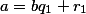
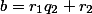
...
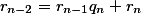
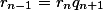

#### Пример: 
```
Пусть а = 777, b = 629

777 = 629 + 148
629 = 148 * 4 + 37
Сколько раз нужно взять 37, чтобы получить 148
148 = 4 * 37

НОД(777, 629) = 37
```

Словесное описание алгоритма нахождения НОД делением:

1. Большее число делим на меньшее
2. Если делится без остатка, то меньшее и есть НОД, следует выйти из цикла
3. Если есть остаток, то большее число заменяем на остаток от деления.
4. переходим к пункту 1.

```
def ev(a,b):
	if(a>=b):
		if(a%b == 0):
			return b
		else:
			return ev(a%b, b)
	else:
		return ev(b,a)

print(ev(777, 629))
```

Нахождение НОД вычитанием:

1. Из большего вычитаем меньшее.
2. Если 0, числа равны и они НОД, выйти из цикла.
3. Если не 0, то большее число заменяем на результат вычитания.
4. Переход к пункту 1.

#### Д/з

```
1. Сосуд имеет емкость 7 и 5 литр:

* требуется получить 1 литр в одном сосуде,
* найти 2 литра в одном сосуде

2. Найти НОД чисел 2n + 13 и n + 7

3. Найти НОД чисел a = {число из 1111....1111  } x 100 шт
b = {1111....1111} x 60 шт
```

### Теория сравнения

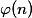

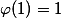

Функция равная количеству натуральных чисел меньших *n* и взаимнопростых с ним. При этом полагают, что число 1 взаимнопростое со всеми числами. 

Функция Эйлера от 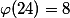

Функция Эйлера применяется в теории чисел, криптиграфии и т.д.

для любых чисел 
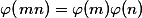

НОД(m,n) = Δ

Функцию Эйлера от простого числа можно найти по следующей формуле.

m - простое

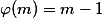

Рассмотрим случай когда m имеет единственный простой делить *p* повторенный несколько раз. 

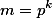

Очевидно, что такое число взаимно простое со всеми числами меньше себя, кроме чисел кратных *p*, а таких чисел получается 

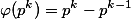.

Если число *m* разложить на простые множители(причем множители повторяются), то мы можем получить исходя из предыдущих формул.

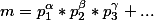

где  - простые числа, тогда учитывая 


Функция Эйлера для произвольного натурального числа основывается на теории **мультипликативности** ф-ции в выражении 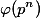

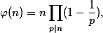,
где n > 1

Наиболее часто на практике используется свойство установленное Эйлером для случая, если *a* и *m* взаимнопросты.

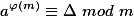

В качестве следствия теоремы Эйлера можно получить малую теорему Ферма, для этого

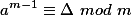


### Классы вычетов

Числа сравнимые по модулю *m* (числа имеющие одинаковые остатки), образую класс вычетов по модулю *m*.

Все числа из одного класса вычетов имеют один и тот же r от деления на *m*.

Любое число *a* из классов вычетов называется вычетом по модулю *m*. Соответсвующий класс обозначается .

Отношение 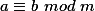 имеет разбиение целых чисел на классы вычетов. Всего имеется *m*-классов вычетов по модулю *m*.

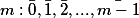

Числа одного класса вычетов имеет с модулем *m* один и тот же делитель.
Рассмотрим те классы для которых этот делитель равен единице. Взяв от каждого такого класса по одному вычету получим приведенную систему вычетов.

#### Пример:

*Найти приведенную систему вычетов по модулю 42.*
m = 42, 

Полная система будет 


Приведенная же 
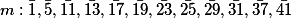
