# Метрология. Стандартизация. Сертификация в информатике и электронике

### Литература
 - Гончаров А.А., Копытов В.В. "Метрология. Стандартизация. Сертификация". МОСКВА
 - Архипенко А.Г. "Метрология. Стандартизация. Сертификация" в 3 частях, БГУиР 2006
 - Атомалян Э.Г. "Приборы и методы и методы измерения электрических величин". МОСКВА

**Метрология** - наука об измерениях, методах, их средствах, обеспечения их единства и точности.
**Стандартизация** - процесс установления и применения стандартов (образцов, эталонов, моделей).
**Сертификация** - процесс подтверждения соответсвия качества изделий, процессов, услуг, действующим нормам и стандартам.

### Метрология

Различают метролигию  теоритеческую, прикладную и законодательную.
Теоретическая метрология рассматривает общие теоретические проблемы измерений.
Прикладная метрология занимается вопросами практического применения методов и средств их применения.
Законодательная - обеспечивает единобразие средств измерений, их единство.

#### Основная цель метрологии:
 Разрабатывать методы измерения требуемой точности измерений.

#### Основные методы измерений

Физическая величина, единицы величин, измерения, средства измерения, погрешности и ошибки измерений и средств измерений.

**Физическая величина** - общее св-во многих физических объектов в качественном отношении, но и индивидуальное для каждого из них в количественном.

**Единицы физической величины** - физическая величина, которой по определению присвоенно числовое значение равное единице.

**Измерение** - процесс определения физ величины с помощью специальных технич средств на основе сопоставления измеряемой величины, на основе сравнения ее с эталоном.

**Средство измерения** - техническое устройство, позволяющее осуществить измерение, имеющее в своей структуре эталон.

**Ошибка измерения** - отклонения результата от истинного значения. 
	Sx = Xизм - Xв

**Погрешность измерения** - возможное отклонение результата измерения от его истинного значения.
	Δ Х = 

> **Д/з:** Узнать в чем разницы между **ошибкой измерениях** и **погрешностью**.
> 
>  *Что общего между **ошибкой измерениях** и **погрешностью**?*
> На основе ошибок измерения определяется погреность.

>  *В чем отличие между ними?*
> В том что ошибка измерений имеет практикеческий характер, а погрешность теоретический.

По способу измерения они измеряются на прямые и косвенные.
**Прямое измерение** - такое в котором значение измеряемой величины определяется не посредственно по шкале прибора.
**косвенное измерение** - такое в котором значение измеряемой величины определяется на основе математических формул.

По характеру проведения измерений они могут быть **абсолютными** и **относительными**.
**Абсолютные измерения** - определяют абсолютную величину
**Относительные** - определ как отношение абсолютного значения к истинному значению измеряемой величины или максимальному в ходе измерений.

В зависимости от характера поведения измеряемой величины она может быть **статической** или **динамической**

**Статические измерения** - это те которые не меняются в ходе измерений.
**Динамические** - меняют свою величину в процессе измерений.

#### Методы измерений

Метод измерений будем рассматривать как комплексное использование принципов и средств измерений. 
**Принципы измерения** - это правила (положения и требования), которые следует выполнять при проведение измерений.
Они могут быть общие (двойственные любым измерениям) и частные (характерные для некоторого класса(типа, вида) измеряемых величин).
Всё многообразие методов электро-радио измерений условно разделяются на два вида - метод непосредственной оценки и метод сравнения.

#### Основные принципы (правила) измерения

Кроме измеренного значения физической величины следует указывать и величину возможной ошибки (погрешности). 

> Всякое измерение должно проверяться многократно.
> 
> Количество ошибки можно характеризовать заданием некоторого верхнего предела модуля.

Однако на практике определить значение Δ Х как надежный передел не возможно. Поэтому величину Dx задают так чтобы она выполнялась с некоторой доверительной вероятностью P. В соответсвии с последним результат измерения записывается так 

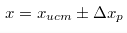
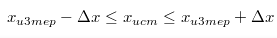

**Погрешность** - возможное отклонение измеряемое величины от ее истиного значения.

В соответсвии с нормами метрологии погрешность Δ X определяется на основе случайной и системотической компоненты.

**Δ Xсист** - систематическая погрешность. Которые как правило являются постоянными или изменяются по заранее известным математическим законам. Обычно к измерительным приборам прилагаются в виде поправочных коэфициентов, таблиц, графиков.

**Δ Хслучайная** - случайная погрешность, появление которой предсказать не возможно. Из-за нее измерение приобретает стахостический (вероятностый) характер.

Имеется множество задач в различных сфера жизнедеятельности человека в которых результат является задачей с многими ( > 3-4 ) переменных. И тогда для их решения применяют вероятностные методы. Это и обусловило наличие величины P в выражении для измерения X.

Измерения которые в дальнейшем будем рассматривать подчиняются нормальному распределению.

Нормальное распределение измерений подчиняется следующим двум положениям:

 1. При проведении большого количества N измерений будет одинаковое количество ошибок Δx как со знаком '+' так и со знаком '-'

> f(ΔX) = f(-ΔX)

 2. Количество ошибок имеющих большие отклонения будет не большим, и будет большим количество ошибок имеющих малое отклонение.

> f(ΔX1) < f(ΔX2)
>  ΔX1 > ΔX2

Нормальное распределение измерений подчиняется следующему закону:

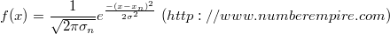
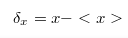

В ходе измерений за истинное значение измерений принимается их средне арифметическая величина.

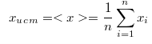

Погрешность записываемая как результат измерений определяется несколькими компонентами основными из которых являются:

 - погрешности прибора ( Δ Х прибора )
 - погрешности округления ( Δ Х округ )
 - систематические (Δ Х сист ) (поправки)
 - случайные ( Δ Х случ) 

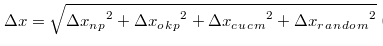

Возможен учет и других видов погрешности

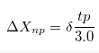
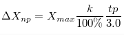

δ  - предельная погрещность прибора ( указыается в его паспортных данных)
К - класс точности прибора
Х max - максимальное значение
tp - коэф Кьюринга, определяется по таблице, в зависимости от количества проведенных измерений N и заданной доверительной P

h - минимальная цена деления на измерительной шкале, либо величина первого плавающего разряда на цифровой шкале

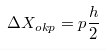

Δ Х сист прилагается к технич паспорту прибора в виде таблиц, формул и т.д.

Случайные погрешности определяются более сложно. Рассмотрим их определение для прямых измерений.

### Оценка прямых равноточных измерений

**Прямыми равноточными измерениями** называются такие измерения которые измеряются одним и тем же прибором, в одних и тех же условиях.

Пусть произвели N измерений . Тогда 

> Δ Xi = Xi - Xcp - ошибка i-го измерения

На основе Δ Xi всех измерений определяем средне квадратичное отклонение i-го измерения.
				
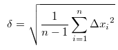

Среднеквадратичное отклонение N измерений

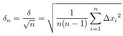

Случайная погрешность N измерений определяется так 

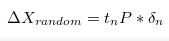

где t n P - коэфициент Стьюдента, который определяется по таблице

Как оказалось если величина Средне Квадартичного Отклонения (СКО) отдельного наблюдений при измерениях не привосходит эту величину, то доверительная вероятность составляет 68%  [σ; -σ]. Если в ходе измерений СКО укладывается в интервале [2*σ; -2*σ ], то доверительная вероятность составляет 95%. Если же СКО укладывается [3σ; -3σ], то доверительная вероятность 99,7%.

Таким образов в общем случае доверительная вероятность P зависит от коэфициента 

![[\lambda p \delta ; - \lambda p \delta] ](images/1_11.png)
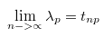

#### Критерий 3х сигм (σ)

Если в ходе измерений |Xi - Xcp| > 3 σm , то результаты таких измерений называются **промахи** и они отбрасываются.

### Оценка случайных погрешностей в косвенных измерениях

При косвенных измерениях интересующая нас величина задается как функция их величин, считаем что значение измерений  распределены по нормальному закону, не зависимы друг от друга ( не коррелированы ), выполненны одним и тем же оператором, прибором, в одних и тех же приборах.

Результат косвенного измерения виден 

Погрешность косвенного измерения определяется на основе совокупности частных измерений.

В общем случае абсолютная погрешность расчитывается в соответсвие с выражением

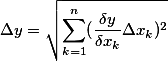

Зачастую гораздо проще определить относительную погрешность, и на её основе абсолютную

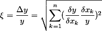

поскольку

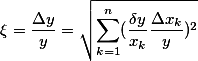

то относительную погрешность можно определять по формулам

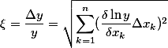

### Критерий ничтожных погрешностей

Если в ходе расчетов появляется погрешности удовлетворяющие условию 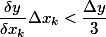
то ввиду их малости ими пренебрегают

Компоненты косвенных погрешностей расчитываются по той же методике, что и для прямых измерений.

#### Измерение мощности в цепи гармонического тока

Пусть измеряем косвенное измерение мощности 

где U,I - соответсвенно напряжение и ток на измеряемом элементе, а  - сдвиг фазы между последними величинами

Определим относительную погрешность измерения

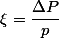

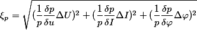

В наших расчетах величину тригонометрической функции будем учитывать с точностью до 4-го знака после запятой, что позволяет исключить из рассмотрения погрешность обусловленную 

Таким образом дальнейшее решение задачи сводится к определению величин:

Эти данные получают на основе эксперимента, который условно отразим в след таблице.

Будем считать, что систематические погрешности отсутсвуют и тогда 

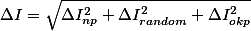

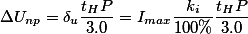

Где, 

 - предельные погрешности указываемые обычно в паспортных данных измерительной техники.

 - максимальные измеряемые величины  на шкале 

 - коэф Стьюдента.

Доверительную вероятность выбираем одинаковую для всех погрешностей .

Погрешности округления для рассматриваемых величин имеют вид 

где  - минимальные деления на измерительной шкале вольтметра, амперметра, фазометра.

Это также могут быть последние плавающие разряды, если указанные приборы являются цифровыми.

На основе известных результатов *n* измерений определяем случайные погрешности имеющие стохастический характер(вероятностный).

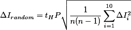

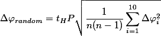

величины  определим как среднее значение 

Истенное значение измеряемой мощности 

На основе естественной относительной погрешности  можно также определить *p*.

#### Метрологическое обеспечение измерений

**Метрологическое обеспечение** - это установление и применение и установление научных и организационных основ, правил и норм необходимых для достижения единства и требуемой точности измерений.

Техническая служба Метрологическое обеспечение имеет след структуры системы:

* Государственных эталонов едениц физических величин.
* передачи размеров от эталоннов физ величин.
* Обязательный гос-ый испытаний Систем измерения при серийном и массовом производстве;
* Обязательный гос-ый и ведомствованной поверки или метрологической аттестации СИ;
* Стандартных справочных данных о физ константах и свойствах веществ и материалов;
* разработки стандартизации, аттестации и сертификации методик выполнения измерений

**Метрологическая служба РБ** - государственная ведомствонная зональная(областная) и производственная
**Метрологический надзор** - деятельность в метрологических службах направленная на контроль действий МО.

Формы метрологического надзора:
	
* поверка(первичная, внеочередная, ревизионная, комплексная);
* экспертиза;
* аттестация средств измерения и методик измерений;

Эталонны физ величин могут быть образцовыми или рабочими, классифицируются на первичные, вторичные, специальные.

Основными эталонами электрических величин являются: ``эталон тока, напряжения, сопротивления, ёмкости, индуктивности, частоты``

### Измерение напряжений

По степени сложности измерений напряжений и токов разделим их на 3 класса:

* напряжение малых величин(мВ и <)
* напряжение средних величин(10...100 мВ - 1000 В)
* напряжение больших величин(1000 В и >)

Сложность измерения напряжений определяется так же и частотой. Наиболее разработанна техника измерений постоянных напряжений, НЧ(низкочастотных) и СЧ(среднечастотных) напряжений.

Затруднительно измерение ВЧ и СВЧ диапозона. Как раз современная электроника в этих диапазонах и работает.

Электроника, радиотехника, электротехника, НЧ, СВЧ и ВЧ диапозона описывается ф-цией гармонического колебания

Для СВЧ функциями волны 

Универсальный измерительный прибор напряжений НЧ, СЧ, ВЧ и даже СВЧ диапазонов - *осциллограф*.

### Осциллограф

#### Физическая модель осциллографа. Обобщенная структурная схема и его параметры

*Осциллограф* - электронный измерительный прибор, позволяющий измерять: напряжение и время, напряжение во времени.

Основные параграфы осциллографа:

1. Полоса измеряемых частот канала Y (современные: 500-600 Мгц).
2. Диапазон измеряемых интервалов времени.
3. Диапазон измеряемых напряжений.
4. Порог чувствительности канала Y.
5. Входные сопротивления канала X,Y входа синхронизации.

Основным узлом осциллографа является его модель на основе ЭЛТ, которая реализуется на её основе и в современных мониторах и телевизорах.

Осциллографы могут быть:

* одноканальными;
* двухканальными;
* многоканальные ( анализаторы спектра);

Рассмотрим одноканальное ЭЛТ

К - катод,
а_1, а_2 - управляющие аноды
X,Y - пластины
а - аквадат

Минимальный комплект осциллографа:

* система канала Y
* система канала X
* калибратор
* блок питания

> Канал Y осуществляет измерение напряжения
> В зависимости от типа ЭЛТ на эти пластины могут подаваться строго определенные напряжения.
> Чтобы согласовывать величины измеряемых напряжений с допустимыми величинами напряжений на канале Y используется 
> система *атинуаторов* и усилителей. Эти функции реализуются барабанным переключателем V/дел.

При отключенном канале Х и подачи напряжения на канал Y на экране будем наблюдать *вертикальную полосу*.
Чтобы наблюдать измеряемый сигнал его необходимо разворачивать во времени по Оси Х с периодом соизмеримым с периодом исследуемого сигнала.
Таким образом канал Х предназначен для развертки частоты луча с частотой равной либо близко кратной к частоте исследуемого сигнала.

В случаях когда неэфективна внутр- используют внешнюю

Режим *внешняя синхронизация* реализуют работу генератора развертки Х осциллографа на основе исследуемого сигнала.
Генератор развертки осциллографа канала Х - генератор линейной изменяющегося напряжения.

T_x - время за которое луч проходит слева на право,
t_ox - время обратного хода

ГЛИН - генератор линейного изменяющегося напряжения.

#### Другие органы управления осциллографа
Земля _|_ - определение нулевого уровня канала У на измерительной шкале осциллографа.

ЗНАЧОК - Изменение сигналов с открытым и закрытым Входом

Схема включения с открытым входом

...

Схема включения осциллографа с закрытым входом

...

При измерении с открытым входом на канал У прибора подается постоянное и переменное напряжение. Если измерение происходит в режиме закрытого Входа,
 то постоянная составляющая отсекается и измеряется только переменная. 

### Функциональная схема осциллографа

*БП* - блок питания

К - система калибровки, выполняется отдельным независимым узлом от прибора. Позволяет количественно оценить качество каналов Х, Y; Обычно на частоте 1 кГц. И напряжениях - 1 Вольт.

Р2-Р5 - делители напряжения, обеспечивающие регулировку яркости, контрастности

RK2 - ступенчатый переключатель Вольт/дел канала Y 
ПК1 - грубая подстройка частоты
R1 - плавная подстройка частоты - '*уровень*'
R6,R7 - сдвиг луча по горизонтали и вертикали.
У1, У2, ..., ДН - усилители(ослабители) измеряемых напряжений барабанного переключателя Вольт/Дел

### Генератор
#### Математическая модель генератора. Физическая модель генератора

Схема 

...

Положимв в момент времени t = 0 размыкаем ключ К. Какой процесс можно наблюдать на осциллографом

U_L = - L \frac{dL}{dt}

L_C = C \frac{dU_c}{dt} 

U_i = \frac{1}{C} интеграл ...

Чтобы привести уравнения к дифференциальному виду - продиффинцируем его.

\frac{d^2 I}{dt^2} + \frac{L}{LC} = 0 

Получили линейное однородное дифф уравнение 2-го порядка, хар-ющее поведение тока в LC цепи после размыкания ключа KП

\frac{1}{LC} = w^2_0

\omega_0 - собственная частота

\frac{d^2 L}{dt^2} + L \omega^2_0 = 0

Характеризует собственную частоту 

Решение уравнения будем производить на основе подстановки Эйлера 

i = i(t) = Л e^{p\alpha}

p^2 = - \omega^2_0

на основе полученного арифметического уровнения имеем комплексные корни, что означает рассматриваемая математика частотно зависимые процессы.

это так же указывает на наличие двух значений решения dU

На основе законов коммутации при t=0 => I=0.

i = 2 j A sin \omega t

как видим в цепи постоянного тока при наличии разнородных носителей энергии - возможен колебательный процесс.

Если Ключ КЛ начать замыкать с частотой \omega_0, то получимт генераторную систему. 

VT - транзистор выполняющий ф-цию ключа
TR - обеспечивает обратную связь в схеме.
R - организует смещение транзистора

#### Условия возникновения генерации в физической системе 

Пусть имеем усилитель с коэфициентом усиления U_{вых} = \beta U_{вх}

подадим 'бэтую' часть выходного сигнала \beta U_{вх} на его вход.

U_{вых} = \beta (U_{вх} + \beta U_{вых})

Определим передточную ф-цию полученной системы.

\fraq_{U_{вых}}{U_{вх}} = fraq_{\beta}{1-\beta k}

Есди \beta_k = 1 то даже при U_{вх} = 0 то U_{вых} != 0

такое состояние физ системы называется *генерацией*.

таким образом генератор - усилитель с обратной связью.
в общем случае величины: U_{вых}, U_{вх}, k и \beta - комплексные числа.

// над каждой буквой нужна точка
\fraq_{\dot{U_{вых}}}{\dot{U_{вх}}} = fraq_{\dot{\beta}}{1-\dot{\beta} \dot{k}}

\dot{\beta}, \dot{k} = 1

физически это означает что сдвиг фазы между входным и выходным сигналом равен 0

такое состояние системы при котором сдвииг фазы между входом и выходом равен 0 называют *положительной обратной связью*. При этом происходит суммирование сигнала обратной связи с сигналом входа(если он имеется)

Итак *генератор* - это усилитель с положительной обратной связью.

Однако при больших значениях k еденицей в знаменателе можно пренебречь и на выходе системы так же будет присутствовать выходной сигнал.

Итак *генератор* - это усилитель с положительной обратной связью и большим коэффициентом усиления.

#### Генератор сигналов с мостом Вина

В современной электронике усилители как правило организованно на основе операционных усилителей. Последние сочетают в себе идеальные свойства электронного усилителя(большое входного бесконечно малое сопротивление, бесконечно большой коэффициент усиления). Типичные параметры Операционного Усилителя(ОУ):

R_{вх} = 10 х ОМ ... 1 МОм

R_{вых} = 10 ОМ ... 1 кОм

R = 10 ^ 6

В ОУ осуществляется усиления разности входных его напряжений.

(рисунок)

Определим условия генерации ОУ DA с мостом Вина. В системе возникнет генерация, если в
\dot{\beta}, \dot{k} = 1

R_{вх\ ОУ}  приблизительно равен бесконечности.

\dot{\beta} = \fraq_{R}{3R + \gamma R^2 w c} + \fraq_{1}{jwc}

Для того чтобы в рассматриваемой системе возникла генерация необходимо чтобы комплексная часть коэффициента \dot{\beta} была равна нулю.

Таким образом усилителя с мостом Вина возвникнет генерация, если коэффициент усиления основного канала будет равен 3.

Из равенства нулю мнимой части коэффициента \beta определяем частоту генерации, тоесть такую частоту для которой при данных значениях R и C выполняется условие положительной обратной связи.

w = \fraq_{1}{RC} = 2 \pi \ню = \fraq_{2 \pi}{T}

называются условиями стационарности генератора. 

Помимо рассмотренной модели генератора существует еще генератор с фазо сдвигающей цепочкой(k=29), генератор Полпицца.

Параметры:

* Диапазон частотных сигналов.
* выходная мощность генератора.
* точность выходного сигнала

По использованию частотных диапазонов генераторы разделяются на:

* НЧ (1Гц - 10тки кГц)
* CЧ (10тки кГц - 100тни кГц)
* ВЧ (100тни кГц - 100 Мгц)
* СВЧ (100 МГц - выше)

Современная радиоэлектроника немыслима без генераторов качающей частоты. Они по оси X обеспечивают координату частоты, по оси Y - коэф усиления. Позволяют непосредственно на экране ЭЛТ (монитора) количественно получать АЧХ, АФЧХ.

На основе генератора гармонич колебаний с мостом Вина реализуется генератор прямоуголных импульсов. Для этого необходимо реализовать R >> 3
Чем меньше R, тем меньше время затягивания переднего и заднего фронтов.

Однако генератор импульсов возможно реализовать и на основе цифровой электроники, например на элементах 2 и НЕ

Логические функции И или НЕ реализуются на основе аналогов электрических схем работающих в режиме насыщения.

### Функциональная схема генератора с мостом Вина

(БОЛЬШАЯ СХЕМА)

DA - прямой канал усилителя генератора.
ПК31 - ступенчатый переключатель уровня выходного сигнала.
Р13 - регулятор плавной регулировки уровня выходного сигнала.
ПК2 - переключатель режима "гармонический сигнал/импульс".
ПК11, ПК12 - ступенчатый переключатель для частот выходного сигнала.
Р4, Р6 - плавная подстройка частоты в выбранном диапазоне частот сигнала.
Переключатели ПК11, ПК12 находятся на общей оси, так же как на общей оси находятся резисторы плавной подстройке частоты Р4 и Р6.
Резисторы Р5 и Р7 являются ограничивающими для цепей подстройки частоты. 
Р2 и Р1 орагнизуют коэффициент усиления основного канала, который позволяет на выходе устройства получать гармонический сигнал.
Резистор Р3 совместно с Р1 задают бесконечно большое усиление основному каналу генератора и реализуют на его выходе прямоугольные импульсы.

### Измерение параметров и характеристик элементной базы электроники

Активные - диоды, транзисторы, микросхемы.
и Пассивные -> (потом)

#### Диоды

Элементы электроники пропускающие ток в одном направлении. Свойства конкретного диода определяются его вольт-амперной характеристикой. 

#### Теристор. Его ВАх

